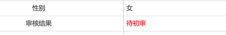

- 线索及投稿： <a href="mailto:sz.better2020@hotmail.com">sz.better2020@hotmail.com</a>
	- 本文仅做事实记录，不收录个人情绪类文字，不收录未经证实的传言。
	- 本文有侵权之处，请邮件告知。
- 分享本文：

## 背景

福田区教育局官网的初中报名时间表

## 时间线

### 5.29（周五）

- 上午：报名初验最后一天，深圳高级中学初中部南校区所辖学区的8个小区（泰康轩、泰安轩、泰然公寓、财富广场、安华小区等）在系统上查询结果为：“初审不通过，第一类要求住宅用途商品房”。

- 上午：部分小区前往福田教育局，匆匆提交了一份手写的诉求，网上流传甚广，但漏掉了安华等没有及时赶到的小区。

- 下午：8小区百余家长前往福田教育局询问情况，情绪激动，但没有肢体冲突，最终教育局领导与8个小区的8位代表（最初的8代表）单独沟通，给出初步承诺：教育局把系统显示先修改为“待评审”，并接受申诉书，6.3给结果。所有家长在被大量维稳人员“保护”下依次检查身份证后离场。

### 5.30（周六）

- 各小区分头撰写《申诉书》，有些小区单独写，如泰康轩、泰安轩；有些小区合写 —— 所以总共撰写和提交了多份《申诉书》。
- 相关家长积极积极调研、找资料、发帖、互相通知……开始进行基础工作

### 5.31（周日）

- 上午10:00，第一现场在泰康轩附近进行采访，部分家长和代表参与了采访。
- 下午2:30开始，在泰康轩、泰安轩的小区内，组织了8个小区的签名，每人在5份白纸上签字并手印，准备用于投递到不同的信访部门。

- 晚上，第一现场播出了相关采访和报道，其中深高级对记者讲述了“千万豪宅的业主希望得到学位关注，早早提出要求，经区教育局批示，进行的此操作”，暴露多个问题
    - 既然是早早提出，为什么在5.29（5.28两会结束）、初验最后一天突然执行。
    - 深高级和教育局都知道此事，为什么没有任何通知、公示。
    - 为什么特意提出千万豪宅 —— 此言论被群众们形容为“拥抱白富美、抛弃老破小、嫌贫爱富、甚至劫贫济富”，引起网络广泛关注。
    - 视频链接：
        - [积分入学遇难题 一类生源变三类](http://static.scms.sztv.com.cn/ysz/dsdb/dspd/dyxc/78188827.shtml)
        - [校方回应：学位紧张引发调整 如何定性还未决定](http://static.scms.sztv.com.cn/ysz/dsdb/dspd/dyxc/78188825.shtml)

### 6.1（周一）

- 上午：个别家长前往市教育局（市民中心）咨询，但被强制要求去市教育局的接访地址（红岭中路1042号）。多位家长递交了反馈材料，但市教育局反复陈述与区教育局无直属领导关系，需要向区委区政府反馈。
- 上午：部分家长前往新闻路山水大厦的规划和自然资源局（规自局）递交查询小区土地性质的申请，得到答复6.3日可领取资料，并拿到了回执。
- 下午：众多家长前往区教育局，并且在大雨中站在院子里，希望与楼上的领导对话，千呼万唤，于下午4点左右，副局长文局答应每个小区派5位代表依次沟通，持续到6点多结束（后来得知，有一个小区因时间太晚，约定明日14:30与文局谈）。

- 由于个别小区被暗示已通过，另外小区则希望渺茫，家长微信群里被暗示小区骤然收声。
- 个别业主对沟通结果失望，自发在教育局门口跪倒哭诉，最终被强制带离（后传言有说被拘留数日，有说没有，无可靠消息）。

### 6.2（周二）

- 个别小区的家长继续前往区教育局，教育局人员说昨天已接访，今天不安排——上午无果。
- 下午除被暗示小区（泰康轩、泰安轩、竹园）之外的5个小区的人员聚集近百，原定文局与一个小区接访，最终促成田局长与5个小区所有家长一起对话。
    - 首先国土局的某领导宣读了一份未发布的函件，表达了工业用地没有配套学位的笼统观点，宣读完后随即离开。
    - 然后田局独讲，着力描述了自己在福田教育中的付出和业绩，最后强调了工业用地没有配套学位的观点，但对涉及家长关心的积分等实质内容、对家长提问的同房不同策、同区不同策等问题均不予以回应。
    - 家长们简单总结就是：**由于深高级初中部学位紧张，学区内土地性质为工业、商业的住宅类市场商品房被踢出一类（80）积分**。

### 6.3（周三）

- 6.3是5.29区教育局承诺给结果时间，直到下班，家长没有拿到任何正式通知。
- 晚上，家长陆续收到了限6月5日18:00 在系统完成特殊房产（3类积分）修改和提交的短信。

- 同时报名系统上的状态信息被改为“初审不通过”

- 同时房产选择项也被调整，新增了“自购公寓、单身公寓、宿舍、单身宿舍、商务公寓、综合楼等（xxx）”三栏，将公寓、宿舍划入特殊房产，按70分计。

 

- 晚上，社区10+人团队在各个小区查居住。
- 深夜，21位今年报名的家长接到电话，被统一要求参加第二天早上的约谈。

### 6.4（周四）

- 9:30，沙头街道办，区教育局田局长与21位家长沟通，田局言辞恳切，并表达了他的难处及对深高级这种特权学校的无奈，对教育公平的自己的看法，并口头表达了尽力安排21位家长区属学位的愿望。—— 基本可以解读为：**80分和深高级无望。**
- 下午，部分家长列出了自己希望的区属学校，递交到区教育局wu科长处。
- 下午，田局又接访了一些家长（具体情况未知），同时流出了一段53秒的录音，田局表示：
    - 规土部门的证明已经出具，但不给大家看，只给读。
    - **全区执行**
    - **重新梳理中、小学积分**  —— 无疑是重磅炸弹。

<audio id="audio" controls="" preload="none">
<source id="mp3" src="voice/20200604_1.mp3">
</audio>

- 规自局
    - 上午，有家长再次前往要求规自局出具6.1承诺给出的土地性质证明文件，但得到昨晚有小偷在规自局偷盗，导致资料无法提供。
    - 下午，多个小区业主在规自局咨询“6.1提交的土地性质查询回复”的事情，最终规自局、教育局、政法委等多部门联合接访了5个小区的5位代表，并表达了把今年上学问题先解决，积分和土地性质再讨论的意见。

<audio id="audio" controls="" preload="none">
<source id="mp3" src="voice/20200604_gzj01.m4a">
</audio>
<audio id="audio" controls="" preload="none">
<source id="mp3" src="voice/20200604_gzj02.m4a">
</audio>

- 报名系统的状态当晚又被修改为待初审

### 6.5（周五）

- 福田区其他街道多个类似小区看到媒体报道后也陆续前往教育局、规自局咨询。
- 田局前一天的谈话片段被网友相继放出。

### 6.6（周六）

- 开始在百花、华强北、八卦岭等片区的业主群里发酵。深高南5小区逐步获得了相关小区的关注和支持。

### 6.7（周日）

- 下午，社区工作人员陪同记者在多个相关小区走访，问了一些：搬过来多久了、户口落在哪里……基础问题，没有有深度的问题和沟通。
- 媒体
	- 广东电视台给予了4分钟的报道

### 6.8（周一）

- 部分安华、泰然的家长继续请假前往市教育局、区教育局咨询，但没有得到任何结果。
- 媒体
	- 陆晖律师公众号：深高南学位事件如何破局
- 相继有家长收到短信：

### 6.9（周二）

- 媒体
	- 风财经：《深圳学区风波背后：一场迟到的土地与学位供应紧缺》
	- 《深高南学位风波的危险信号》—— 已和谐
	- 《深高南学位之殇-不是不同意改革，而是不同意耍流氓似的改革》——已和谐
	- 房网：《我查了福田1570个地块，发现这50个地块/楼盘若申请深高南可能也会卡在土地用途上》

### 6.10（周三）

- 早上8:30开始，财富广场有近百名家长聚集，并拉起来横幅，同时在财富广场小区内聚集、唱国歌，大概持续了2h。

<video id="video" controls="" preload="none" >
<source id="mp4" src="video/20200610.mp4" type="video/mp4">
</video>

### 6.11（周四）

- 福田教育局宣布从6.12-6.18在财富广场3f接访一周。

### 6.12（周五）

- 早上，幸福福田公众号发布官宣文章：表达了4点
	- 福田学位充足
	- 不是政策变化，而是回归
	- 有人在炒作
	- 整顿行业乱象
-  多篇文章逐一批驳了官宣中的4点，如：
	- 朱罗纪：《阅读理解：教育部门的通报》
- 官宣文章引起轩然大波，下午，财富广场和华强北大量家长聚集，据传有街道办领导对公众喊话：
	- 今年政策不变，仍是80分。
	- 网站报名系统的房屋分类改回5.29前模样。
- 当晚，网站报名系统恢复到5.29前 —— **家长们似乎看到了一丝希望**：

- 晚上群里有人提到，街道办接访小组除了财富，也在安华等其他小区管理处开始部署，前日深夜已开始逐个敲门，单独约见。—— 这种接访方式也够特别了，不通知、不公告，深夜敲个别人（初步猜测是只敲了今年报名家庭）的门，单独、逐个接访 —— 这是喝茶约谈，还是接访？

### 6.13（周六）

- 下午：安华管理处接访组的消息在小区内传播，家长来了十多位，接访组表达了一些信息：
    - 总结整理家长诉求然后向上递交，但未做任何承诺。
    - 某坚决不告知姓名和职位的领导声称：**降级政策全市执行！对昨天其他街道办的不降级承诺不予认可。—— 家长们再次跌入深渊。**
- 小道消息：晚上，有人告知周三财富事件后，有若干家长被训诫和5-7天的限制——待求证。
- 媒体：
	- 10:53 财新网微博：《遭住宅业主投诉，深圳公寓业主子女小升初入学资格降级》。
	- 22:30 广东电视台：《新闻追踪：深圳福田区通报“跪求学位”事件》。
	- 23:33 华夏时报：《深高南学位之争：临入学却因房屋属性被“踢出”学区房阵营》。
	- 米宅珠三角公众号：《一波三折的深高南学位事件，什么是真正的公平？》。

### 6.14（周日）
- 媒体
	- 《深高南学位问题过程暴露福田区教育局长田洪明涉嫌多项纪律问题》 —— 不久即和谐。
