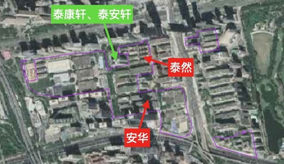
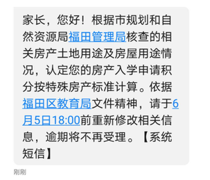
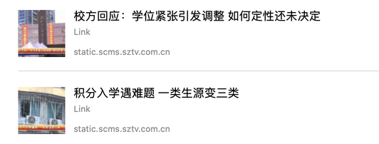

- 爆料、咨询、勘误：<a href="mailto:szbetter2020@protonmail.com">szbetter2020@protonmail.com</a>
	- 本文仅做事实记录，不收录未经证实的传言，不收录个人情绪类文字。
	- 本文有侵权之处，请邮件告知。
- 本文分享链接：

## 置顶信息

- [媒体报道：推荐阅读](./media.html) —— 掌握事件来龙去脉、各方观点。
- [必备技能：查地籍、查图则等](./gov.link.html) —— 深圳买学位房如履薄冰，如何防范最终解释权。
- [维权途径：纪监委举报、信访、行政复议等](./take.my.right.html) —— 不希望走到这一步，但有时不得已。

## 时间线

### 6.24（周三）（第27天）

- 红岭中路1042号，市教育局信访中心，财富预约了13:00沟通（而不仅仅是以前的写份材料），其他小区也相继赶过去，每个小区5名代表，应该会谈到很晚。

### 6.23（周二）（第26天）

- 福田区小一报名今天 17:00 积分最终公布
    - 华强片区的公寓、宿舍按80分计算。
    - 此次事件5小区中的小一申请人数较少，是否80分还有待确认，当前消息仍是80分。
    - **田局的“今年福田小学也要降积分”的目标应该要落空了。**
- 媒体&自媒体
    - 陆晖律师: 《关于深高南学位“认定标准”的几点思考》[微博](https://weibo.com/ttarticle/p/show?id=2309404519112427569990)、[截图](media/0623_rendingbiaozhun.png)

### 6.22（周一）（第25天）

#### 市长表态

今天，在深圳市人民来访接待厅（原深圳市信访大厅），陈如桂市长与几位此次事件的业主/家长“偶遇”，进行了简短、亲切交谈。

大家表达了此次事件对众多家庭的重大打击、是否真的要全市推行等令人焦虑的问题。其中一位牵着上小学的大宝、抱着10个月二宝的妈妈，倾诉了：“银行知道没学位不再贷款，积分降级学校和学位没了，疫情对老公企业造成严重打击……”。

市长当即表态：**你们的诉求，政府会重视 …… 政府不会贸然的去改变政策，该享受、该保证的要保证到位，但做不到的事情会和你沟通，要研究原来是怎么样的性质 …… 后天（注：6.24），（市委）常委专门研究一下。**

大家拭目以待！

同时向这位带着2位孩子苦等一下午的妈妈致敬！这个背影，与当年爬过月台为买几个橘子的背影一样，让人泪目。

#### 小学报名审核结果出炉，操作让人看不懂

福田区小学报名[官网](https://ftjyk.sz.edu.cn/visitftgbxyjz) （[截图](img/junior.school.sign.system.png)）显示的时间点：材料审核及复核（5月27日-6月29日），6月17日为信息审核不通过复核修改时间，但由于本次事件，6.17改为6.22。

今天（6.22）报名小一的家庭收到短信，摘要：

- 今日17:00后登录系统查看审核结果（包括社保、计生、国土等）、积分明细（教育局）。
- 6.23 9:00 ~ 6.24 9:00 ，24h 内完成修改，逾期不接受。
    - 其中包括对积分有异议，请致电 12356789，逾期未提出视为同意积分核验结果。

但系统上关于积分一栏显示：**2020-06-23 17:00:00 至 2020-07-21 18:00:00 公布结果**，并不是其他项目的“审核通过”字样。—— 操作上也说得通：各政府部门把资料6.22审核完毕，教育局给自己留1天时间计算积分。

但本事件涉及小区家庭有忧虑：

1. 小学是不是今年也强降70分了？—— **只能等明天（6.23）17:00才能知道么？**
2. 系统上6.23 17:00才公布积分审核结果，6.24 9:00 之前提示异议，逾期视为同意 —— **仅有16h（一个晚上），万一被强降70分，打电话能解决？到哪里申诉？教育局都下班了啊！**
3. 既然教育局给自己留了一天计算积分，那给家长“对资料审核异议”和“对积分异议”是不是也应该分开时间要求？

### 6.21（周日）（第24天）

别有幽愁暗恨生，此时无声胜有声。

### 6.20（周六）（第23天）

围绕学位和房价，今天出现了这样两个“有趣”的话题：

1. 微博出现了 [#深圳福田下架四百多套房源#](https://s.weibo.com/weibo?q=%23深圳福田下架四百多套房源%23) 超话 —— 不敢评论。
2. 风口浪尖的8个小区中已被通过的3个小区，房价在中介猛烈飙升，比如 [深圳有小区成交价出现2万/平跳涨](https://mp.weixin.qq.com/s/juRov7EXpchKOW_HCdGBcw) 提到竹园小区 —— 不予评论。

### 6.19（周五）（第22天）

- **上周二、周三被请进去冷(ju)静(liu)的若干业主这几天陆续出来，5-7天的人身自由限制，什么理由、什么性质、什么法律依据……未知**
    - 请当事人或知情者提供信息和证据，此处会予以保密。
    - 如当事人已与相关部门达成协议，也深表理解。
- 南山区的相关小区也开始焦虑，流出一份南山区某小区业主查档住宅性质认定（南山规土局2017年曾对该土地性质为商业、用途为单身公寓的住宅性质认定），业主主动查档、保存、以备不时之需、保障自己合法权益。

- 媒体&自媒体
    - 证券时报：《单身公寓被拒贷？“深高南学位之争”后续：12万评估价骤降至9万》[凤凰网](https://finance.ifeng.com/c/7xQQLcBf2Gm)、[截图](media/0619_judai.png)
    - 舍或得：《单身公寓打响了深圳住房革命的第二枪》[公众号](https://mp.weixin.qq.com/s/FKBicjzRxrLTmx7LvL3rOQ?)、[截图](media/0619_dierqiang.png)
    - 中教投研：《从事物分类法，谈一谈深圳发生“指鹿为马”的可能性》[微博](https://weibo.com/ttarticle/p/show?id=2309404517301322907918)、[截图](media/0618_zhiluweima.png)
- 收录
    - 网友整理的多段录音：[【福田区入学积分】住宅类公寓业主诉求录音](https://www.meipian.cn/2zyzkljv?mina_from=1)

### 6.18（周四）（第21天）

- **《福田区现状工业区分区划定》（征求意见稿）**于6.15发布，被多家媒体和自媒体报道。
    - 官网公示：[链接](http://www.szft.gov.cn/bmxx/qcsgxj/tzgg/content/post_7794142.html)、[截图](img/0615_zhengqiuyijiangao.png)
        - 附件1：福田区工业区保留提升范围图：[pdf](http://www.szft.gov.cn/attachment/0/681/681260/7794142.pdf)
        - 附件2：福田区工业区连片改造升级范围图：[pdf](http://www.szft.gov.cn/attachment/0/681/681261/7794142.pdf)
    - 《旧改快讯-福田现状工业区分区划定方案出炉：车公庙片区成首批连片改造试点》[原文](https://mp.weixin.qq.com/s/2eTRFc7WI9sjLlM0OQYUAQ)
    - 《最新！意见稿出炉，车公庙片区将连片改造》[原文](https://mp.weixin.qq.com/s/-oaoAByhEjhMM3_8uHrKxw)
    - 要点：**福田区连片改造升级范围全部位于车公庙片区，安华和泰然在改造范围内，泰康轩、泰安轩不在。——此次降积分事件背后的逻辑逐步浮出水面**

- 媒体&自媒体
    - 刘子孺：《再说深高南学位问题-依法才是行政本意》[微博原文](https://card.weibo.com/article/m/show/id/2309404517288786133257?_wb_client_=1)、[截图](media/0618_xingzhengbenyi.jpg)
    - 香港有线进行了报道

- 补录
    - 6.14，《深圳市民对福田区所谓通告的几点疑问》[微博](https://weibo.com/1196289772/J6AF5okye?type=repost)、[截图](img/474deeecgy1gfrr3sfqhcj20x13w97wh.jpg)
    - 6.15，《谈一谈学位房与人口、户籍和住房之间的勾稽关系》[微博](https://weibo.com/2359484705/J6IVpFV8l?type=repost#_rnd1592523069210)、[截图](img/8ca2e121ly1gfsrlorf93j20l08qh1ky.jpg)

### 6.17（周三）（第20天）

- 媒体&自媒体
    - 哈林顿88 ：[《到底深南学位事件的产生根源是什么》](https://weibo.com/ttarticle/p/show?id=2309404516778033152350#_0)、[截图](media/0617_genyuan.png)

### 6.16（周二）（第19天）

- 下午2:00开始，业主/家长获悉某个传言，相继前往福田区教育局咨询问题，至16:00左右，达到近50名，最终教育局答应接访5位代表，其他被要求离开。5位代表事后称：对于代表提问的程序正当、同区同策等问题，接访的文局均不予回答，仅念了公文，**继续坚称“没有改变规则，按土地性质划分”—— 家长对“与区教育局沟通出结果”已基本绝望，称这种接访领导为复读机**。
- 某业主发出了对教育局的檄文

<audio id="audio" controls="" preload="none"><source id="mp3" src="audio/20200616_205842_1_1.mp3"></audio>
<audio id="audio" controls="" preload="none"><source id="mp3" src="audio/20200616_205842_1_2.mp3"></audio>

### 6.15（周一）（第18天）

- 多位家长打电话咨询福田教育局，回复说：**今年房产认定恩积分修改只针对深高南，明后年的政策“未知”。—— 不仅严重侵犯高级南5小区的合法权益，还给福田区其他小区埋下了严重隐患。**
- 缔馨园小区（土地用途：商业；房屋用途：单身公寓）可以办理房产证变更 —— **公然的“同区不同策”让人浮想联翩**

<audio id="audio" controls="" preload="none"><source id="mp3" src="audio/20200615_dixinyuan.gai.fangchanzheng.mp3"></audio>

- 竹林香岭社区发出2封申请函，申请将教科院并入深高级

### 6.14（周日）（第17天）

- 媒体
	- 《深高南学位问题过程暴露福田区教育局长田洪明涉嫌多项纪律问题》 [原文（已和谐）](https://www.meipian9.cn/2zxluuly?share_depth=2&user_id=ohbsluMU0XU4OlRuflQRF1T0BvEA&sharer_id=ojq1ttyc0y47rGW_1AdQgEEz7uEk&first_share_to=&first_share_uid=ohbsluBWUr-7YtTFufuPJ80FZg3M&share_source=timeline&from=groupmessage&isappinstalled=0)、[截图]()

### 6.13（周六）（第16天）

- 下午：接访组进驻安华管理处的消息在小区内传播，家长来了十多位，接访组转达了一些信息：
    - 会总结整理家长诉求，然后向上递交，但未做任何承诺。
    - 某坚决不告知姓名和职位的领导声称：**降级政策全市执行！对昨天其他街道办的不降级承诺不予认可。—— 家长们再次跌入深渊。**
- 小道消息：晚上，有人告知周三财富事件后，有若干家长被训诫和5-7天的限制——待求证。
- 流出一份疑似政府内部对多个部门口径指导的文件，重点包括
    - 10个涉访公寓（宿舍）最终认定情况：3个80分，其他70或65分。
    - 新建豪宅也在深高级是历史原因。—— **20多年的历史不认，才几年的历史认的倒挺清。**
    - 限购限贷与房屋用途关联，与土地性质无关，所以与学位也无挂钩。—— **相信与大部分深圳老百姓的理解不符，定义就是这么豪横。**
    - 一事一议、一房一判断、一人一回复 —— **这么大的自由度！令人惊愕！**

点击下图打开完整4页

- 媒体：
	- 10:53 财新：《遭住宅业主投诉，深圳公寓业主子女小升初入学资格降级》[原文](http://www.caixin.com/2020-06-13/101566785.html)、[微博链接](https://weibo.com/1663937380/J6qeED3Q8?ref=collection&type=comment#_rnd1592362318674)、[截图](media/0613_zaozhuzhaiyezhutousu.jpg)
	- 22:30 广东电视台：《新闻追踪：深圳福田区通报“跪求学位”事件》[视频链接](http://v.gdtv.cn/zj/jrgz/2020-06-13/2427125.html)。
	- 23:33 华夏时报：《深高南学位之争：临入学却因房屋属性被“踢出”学区房阵营》[原文](https://www.chinatimes.net.cn/article/97659.html)、[微博链接](https://weibo.com/1838672663/J6vntiQIG?type=comment#_rnd1592358755074)、[截图](media/0613-shen.gao.xue.wei.zhi.zheng.png)
	- 米宅珠三角公众号：《一波三折的深高南学位事件，什么是真正的公平？》[原文](https://mp.weixin.qq.com/s/bJByYYvUw1rjDCht4ql5ow)、[截图](media/0613-yi.bo.san.zhe.png)

### 6.12（周五）（第15天）

- 早上，幸福福田公众号发布官宣文章，表达了4点，**把事件从学位问题向污名化炒房客方向带节奏**。
	- 福田学位充足
	- 不是政策变化，而是回归
	- 有人在炒作
	- 整顿行业乱象
- 多篇文章逐一批驳了官宣中的4点，如：
	- 朱罗纪：《阅读理解：教育部门的通报》[原文（已和谐）]()、[截图](media/0612_yuedulijie.jpg)
- 官宣文章引起轩然大波，下午，财富广场和华强北大量家长聚集，华强参与的小区包括：阁林网苑、现代之窗、赛格广场等，据传有街道办领导对公众喊话：
	- 今年政策不变，仍是80分。
	- 网站报名系统的房屋分类改回5.29前模样。

- 当晚，网站报名系统恢复到5.29前 —— **家长们似乎看到了一丝希望**：

- 晚上群里有人提到，街道办接访小组除了财富，也在安华等其他小区管理处开始部署，前日深夜已开始逐个敲门，单独约见。—— 这种接访方式也够特别了，不通知、不公告，深夜敲个别人（初步猜测是只敲了今年报名家庭）的门，单独、逐个接访 —— 这是喝茶约谈，还是接访？

- 媒体
    - 《深高南学位积分引关注，福田区教育局答复人大代表》[原文](https://new.qq.com/omn/20200612/20200612A073RH00.html)、[截图](media/0612-rendadaibiao.png)

### 6.11（周四）（第14天）

- 福田教育局宣布从6.12-6.18在财富广场3f接访一周。

### 6.10（周三）（第13天）

- 早上8:30开始，财富广场有近百名家长聚集，并拉起来横幅，同时在财富广场小区内聚集、唱国歌，大概持续了2h。

### 6.9（周二）（第12天）

- 媒体
	- 朱罗纪：《深高南学位风波的危险信号》[原文（已和谐）]()、[截图](media/0609_weixianxinhao.png)
	- 刘子孺：《深高南学位之殇-不是不同意改革，而是不同意耍流氓似的改革》[原文](https://weibo.com/ttarticle/p/show?id=2309404513904922329285#_0)、[截图](media/0609_xueweizhishang.png)
	- 房网：《我查了福田1570个地块，发现这50个地块/楼盘若申请深高南可能也会卡在土地用途上》[原文](http://bbs.szhome.com/30-20001-detail-177813581.html)
	- 风财经：《深圳学区风波背后：一场迟到的土地与学位供应紧缺》[原文](https://shanghai.louxun.com/toutiao/detail-2540355123809502215.html)

### 6.8（周一）（第11天）

- 部分安华、泰然的家长继续请假前往市教育局、区教育局咨询，但没有得到任何结果。
- 相继有家长收到短信：

- 媒体
    - 每日经济新闻：[《深度-还原深高南学位房争议的216小时》](http://www.nbd.com.cn/articles/2020-06-08/1443881.html)、[截图](media/0608_shenduhuanyuan.png)

### 6.7（周日）（第10天）

- 下午，社区工作人员陪同记者在多个相关小区走访，问了一些：搬过来多久了、户口落在哪里……基础问题，没有有深度的问题和沟通。
- 媒体
    - 陆晖律师：《深高南学位事件如何破局》[原文](https://mp.weixin.qq.com/s/upyaAKgWCO1A1e7we_D7iw)、[截图](media/0607_ruhepoju.png)
	- 广东电视台给予了4分钟的报道

### 6.6（周六）（第9天）

- 开始在百花、华强北、八卦岭等片区的业主群里发酵。深高南5小区逐步获得了相关小区的关注和支持。

### 6.5（周五）（第8天）

- 福田区其他街道多个类似小区看到媒体报道后也陆续前往教育局、规自局咨询。
- 田局前一天的谈话片段被网友相继放出。

### 6.4（周四）（第7天）

- 街道办接访
    - 上午，沙头街道办，区教育局田局长与安华、泰然等21位今年报名初一的家长沟通，田局言辞恳切，表达了他的难处及对深高级这种特权学校的无奈，对教育公平的自己的看法，并口头表达了尽力安排区属学位的愿望。—— 基本可以解读为：**80分和深高级无望。**
    - 下午，田局又（在香蜜街道办）接访了财富等（27位）今年报名的家长，内容雷同，晚些时候流出了一段53秒的录音，田局表示：
        - 规土部门的证明已经出具，但不给大家看，只给读。
        - **全区执行**
        - **重新梳理中、小学积分**  —— 无疑是重磅炸弹。
        <audio id="audio" controls="" preload="none"><source id="mp3" src="audio/20200604_1.mp3"></audio>
    - 据悉，当天就有部分家长列出了自己希望的区属学校，递交到区教育局wu科长处，后续预估会有大部分家长递交。
- 规自局
    - 上午，有家长再次前往要求规自局出具6.1承诺给出的土地性质证明文件，但得到昨晚有小偷在规自局偷盗，导致资料无法提供。
    - 下午，多个小区业主在规自局咨询“6.1提交的土地性质查询回复”的事情，最终规自局、教育局、政法委等多部门联合接访了5个小区的5位代表，并表达了把今年上学问题先解决，积分和土地性质再讨论的意见。

<audio id="audio" controls="" preload="none"><source id="mp3" src="audio/20200604_gzj01.mp3"></audio>
<audio id="audio" controls="" preload="none"><source id="mp3" src="audio/20200604_gzj02.mp3"></audio>

- 报名系统的状态当晚又被修改为待初审

### 6.3（周三）（第6天）

- 6.3是5.29区教育局承诺给结果时间，直到下班，家长没有拿到任何正式通知。
- 晚上，家长陆续收到了限6月5日18:00 在系统完成特殊房产（3类积分）修改和提交的短信。

- 同时报名系统上的状态信息被改为“初审不通过”

- 同时房产选择项也被调整，新增了“自购公寓、单身公寓、宿舍、单身宿舍、商务公寓、综合楼等（xxx）”三栏，将公寓、宿舍划入特殊房产，按70分计。

 

- 晚上，社区10+人团队在各个小区查居住。
- 深夜，21位今年报名的家长接到电话，被统一要求参加第二天早上的约谈。

### 6.2（周二）（第5天）

- 个别小区的家长继续前往区教育局，教育局人员说昨天已接访，今天不安排——上午无果。
- 下午除被暗示小区（泰康轩、泰安轩、竹园）之外的5个小区的人员聚集近百，原定文局与一个小区接访，最终促成田局长与5个小区所有家长一起对话。
    - 首先国土局的某领导宣读了一份未发布的函件，表达了工业用地没有配套学位的笼统观点，宣读完后随即离开。
    - 然后田局独讲，着力描述了自己在福田教育中的付出和业绩，最后强调了工业用地没有配套学位的观点，但对涉及家长关心的积分等实质内容、对家长提问的同房不同策、同区不同策等问题均不予以回应。
    - 家长们简单总结就是：**由于深高级初中部学位紧张，学区内土地性质为工业、商业的住宅类市场商品房被踢出一类（80）积分**。
- 媒体
    - 湾区经济评论：《深圳中浪的哭泣》[虎嗅链接](https://m.huxiu.com/article/360356.html)、[网易财经链接](https://money.163.com/20/0602/14/FE4HABHE00259DLP.html)、[截图](media/0602_zhonglangdekuqi.png)
    - 房掌柜：《400多万的学区房不配上深高？》[乐居链接](https://news.leju.com/2020-06-02/6673391224667553275.shtml)、[截图](media/0602_400duowan.png)
    - 深圳商用地产资讯：《深高学位之争，教育资源分配机制缺失，千万房产才能上？》

### 6.1（周一）（第4天）

- 上午：个别家长前往市教育局（市民中心）咨询，但被强制要求去市教育局的接访地址（红岭中路1042号）。多位家长递交了反馈材料，但市教育局反复陈述与区教育局无直属领导关系，需要向区委区政府反馈。
- 上午：部分家长前往新闻路山水大厦的规划和自然资源局（规自局）递交查询小区土地性质的申请，得到答复6.3日可领取资料，并拿到了回执。
- 下午：众多家长前往区教育局，并且在大雨中站在院子里，希望与楼上的领导对话，千呼万唤，于下午4点左右，副局长文局答应每个小区派5位代表依次沟通，持续到6点多结束（后来得知，有一个小区因时间太晚，约定明日14:30与文局谈）。

- 由于个别小区被暗示已通过，另外小区则希望渺茫，家长微信群里被暗示小区骤然收声。
- 个别业主对沟通结果失望，自发在教育局门口跪倒哭诉，最终被强制带离（后传言有说被拘留数日，有说没有，无可靠消息）。

### 5.31（周日）（第3天）

- 上午10:00，第一现场在泰康轩附近进行采访，部分家长和代表参与了采访。
- 下午2:30开始，在泰康轩、泰安轩的小区内，组织了8个小区的签名，每人在5份白纸上签字并手印，准备用于投递到不同的信访部门。

- 晚上，第一现场播出了相关采访和报道，其中深高级对记者讲述了“千万豪宅的业主希望得到学位关注，早早提出要求，经区教育局批示，进行的此操作”，暴露多个问题
    - 既然是早早提出，为什么在5.29（5.28两会结束）、初验最后一天突然执行。
    - 深高级和教育局都知道此事，为什么没有任何通知、公示。
    - 为什么特意提出千万豪宅 —— 此言论被群众们形容为“拥抱白富美、抛弃老破小、嫌贫爱富、甚至劫贫济富”，引起网络广泛关注。
    - 视频链接：
        - [积分入学遇难题 一类生源变三类](http://static.scms.sztv.com.cn/ysz/dsdb/dspd/dyxc/78188827.shtml)
        - [校方回应：学位紧张引发调整 如何定性还未决定](http://static.scms.sztv.com.cn/ysz/dsdb/dspd/dyxc/78188825.shtml)

- 媒体
    - 米宅珠三角：《深高南事件继续发酵，业主准备集体诉讼》[原文](https://mp.weixin.qq.com/s/Jr5OwPkUdF__G6cj2G6dpg)、[截图](media/0531_jixufajiao.png)

### 5.30（周六）（第2天）

- 各小区分头撰写《申诉书》，有些小区单独写，如泰康轩、泰安轩；有些小区合写 —— 所以总共撰写和提交了多份《申诉书》。
- 相关家长积极积极调研、找资料、发帖、互相通知……开始进行基础工作

### 5.29（周五）（第1天）

- 上午：报名初验最后一天，深圳高级中学初中部南校区所辖学区的8个小区（泰康轩、泰安轩、泰然公寓、财富广场、安华小区等）在系统上查询结果为：“初审不通过，第一类要求住宅用途商品房”。

- 上午：部分小区前往福田教育局，匆匆提交了一份手写的诉求，网上流传甚广，但漏掉了安华等没有及时赶到的小区。

- 中午：焦急的家长在区教育局门口用白纸黑字简单的表达愿望

- 下午：8小区百余家长前往福田教育局询问情况，情绪激动，但没有肢体冲突，最终教育局领导与8个小区的8位代表（最初的8代表）单独沟通，给出初步承诺：教育局把系统显示先修改为“待评审”，并接受申诉书，6.3给结果。所有家长在被大量维稳人员“保护”下依次检查身份证后离场。

### 源起

福田区教育局官网的初中报名时间表

